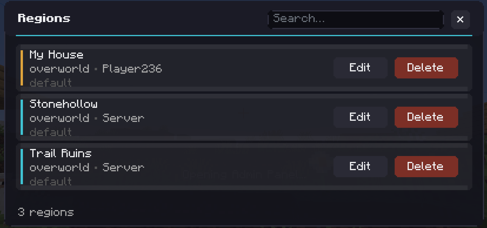

# The Admin Compass

The Admin Compass is how you manage regions without typing anything. Right click it and a panel opens listing the regions you are allowed to see.



## Getting one

Craft it from a map, a compass and a stick, stacked vertically with the map on top.

```
   M
   C
   S
```

It is also in the Location Tooltip creative tab.

Anyone can craft one and anyone can open it. What you see inside depends on who you are, which is the next section.

## What you see in it

**If you are an admin**, every region within range, whoever made it. Each row shows the name, the dimension, who owns it and the protections it has set.

**If you are a normal player**, only the regions you own. If you have not made any, the list is empty, and that is normal rather than broken.

There is one extra thing a normal player can see, which is a village they are standing in when the server has player naming switched on. That row shows up with a Name button on it. See [Villages and Structures](Villages-and-Structures).

## Reading a row

The coloured dot on the left tells you where the region came from. Blue means it was created automatically for a structure. Orange means a person made it.

Under the name you get the dimension and, if you are an admin, the owner. Server owned regions show as Server.

Along the bottom of the row are the protections that region has explicitly set, drawn as small icons with a green or red bar under them. Green is allowed, red is denied. Flags left on Inherit are not shown at all, so a region reading `default` has no opinions of its own.

## Searching

The box at the top filters the list as you type. It matches on the name, so if you have three hundred shops and you want Bob's, type Bob.

## Editing

Hit Edit on a row and you get the same screen you saw when you created the region. Change the name, cycle the protection flags, save.


Two things worth knowing.

Renaming a region that was made automatically for a structure converts it to a normal region. It stops being managed by the automatic tagger and nothing will rename it later. This is how you claim a village or a fortress properly.

Saving writes whatever the grid currently shows. If you open a region, change the name and save, the flags are written as they appear on screen, so do not go clearing things you meant to keep.

## Deleting

Hit Delete. It goes immediately, with no confirmation, so read the row before you click.

Deleting does not touch the world. Blocks stay where they are, and any regions nested inside carry on working. All that changes is that the name and protections from that region stop applying.

## The list refreshes itself

The panel asks the server for a fresh list every few seconds while it is open. So if you walk into a village with the panel up, the row appears on its own without you closing and reopening it.

## The needle

The compass needle points the way a compass normally does. It is cosmetic, and it works the same on every supported version.
