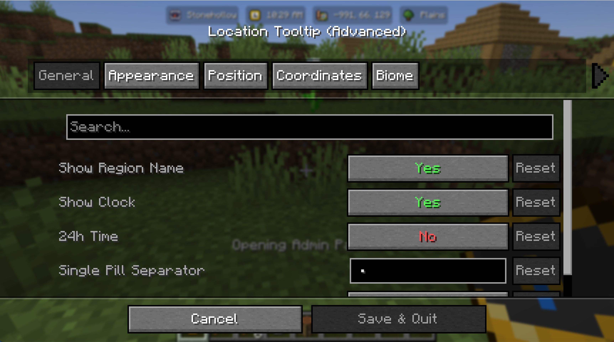

# The HUD

The pills are the bits that sit on your screen. There are four of them and they all work the same way, so once you have moved one you know how to move all of them.

## The four pills

**Region.** The name of wherever you are standing. Out in the open it reads Wilderness, or The Nether and The End if you are in those. On by default.

**Clock.** The in game time. On by default. Set `time24h` if you would rather see 14:30 than 2:30 PM.

**Coordinates.** Your X, Y and Z. Off by default.

**Biome.** The biome you are standing in, using the game's own name for it, so it gets translated properly if you play in another language. Off by default.

## Moving them

Every pill has three settings that decide where it lands.

**Anchor** is one of six spots: top left, top centre, top right, bottom left, bottom centre, bottom right. This is the corner or edge the pill hangs off.

**X offset** pushes it sideways away from that anchor.

**Y offset** pushes it down from the top, or up from the bottom, depending on which anchor you picked.

So a pill anchored bottom right with both offsets at 8 sits 8 pixels in from the bottom right corner. The offsets always push the pill away from the edge it is anchored to, which means you do not have to think about negative numbers.

## Pills that share a spot

Put two pills on the same anchor and they line up in a row rather than stacking on top of each other. They also size themselves identically, so a row of them looks like one deliberate strip rather than three separate things that happen to be near each other.

The row is positioned using the offsets of the first pill in it, and the gap between them comes from the `spacing` setting. If you want them apart, give them different anchors.

The order within a row is fixed: region, then clock, then coordinates, then biome.

## Making them look different

If you have Cloth Config installed, all of this is on a settings screen. Open your mod list, find Location Tooltip and hit Settings. Without Cloth Config, the same settings are in `config/locationtooltip.json` and you edit them by hand.

The ones people reach for most:

**Background opacity** from 0 to 1. Drop it to 0.4 for something subtle, or all the way to 0 if you want floating text with no pill behind it.

**Text scale** from 0.5 to 3. This scales the text inside the pill and the pill grows to fit.

**Corner style** is Round, Pill or Squircle. Round is a normal rounded rectangle, Pill is fully rounded ends, Squircle is the soft square shape that sits between the two. `cornerRadius` controls how much rounding Round gets, and `cornerExponent` tunes the Squircle curve.

**Icon size** is the little picture on each side of the text.

**Spacing** is the gap between pills sharing an anchor.

There are more, including padding, border width, a gradient sheen and a full nine slice texture mode if you want to skin the pills with your own image. All of them are listed in [Configuration](Configuration).

## Turning it off

Set `showRegionName` to false and the region pill goes away. Same for `showClock`, `showCoords` and `showBiome`. Turn all four off and the mod draws nothing at all, which is a reasonable thing to want on a server where you only care about the protections.

## Boss bars

If a boss bar is on screen, the pills that sit at the top get out of the way on their own. You do not need to configure anything for that.
