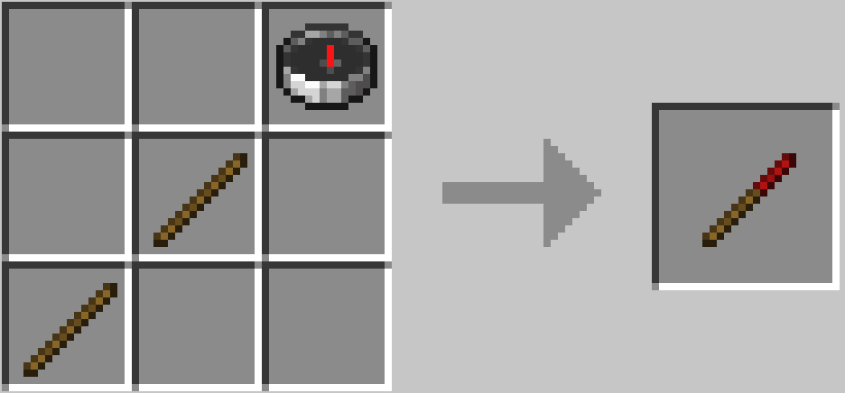
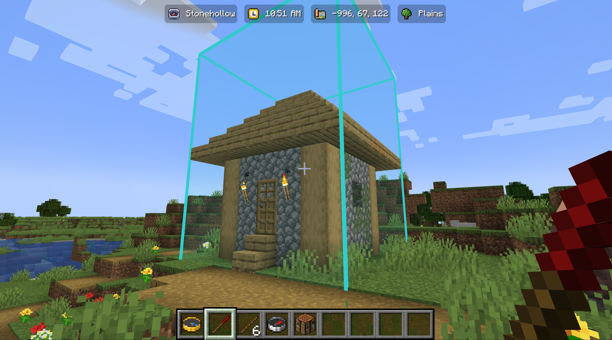
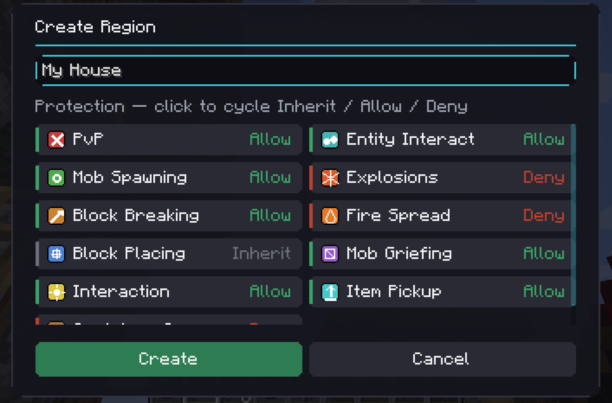
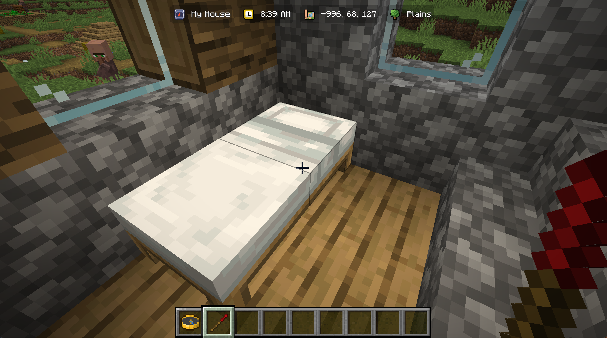

# Your First Region

This takes about two minutes. By the end you will have a named area that shows up on screen when you walk into it.

## Step 1, get a Region Wand

Craft one from a compass and two sticks. The compass goes top right, then a stick below and left of it, running diagonally down.

```
      C
   S
S
```

If you are in creative, it is in the Location Tooltip creative tab along with the Admin Compass.



## Step 2, mark two corners

Right click a block. That is your first corner, and you will get a note on screen confirming it.

Walk to the opposite corner of the area you want, and right click another block. That is your second corner.

The two blocks are opposite corners of a box, so pick them like you are drawing a diagonal across the area. Height counts too. If you click the floor at one end and the floor at the other, your region will be one block tall and you will walk straight over the top of it. Click something high up for your second corner if you want the region to have some headroom.



If you pick a bad corner, right click a third block. That throws the selection away and starts again from the block you just clicked.

## Step 3, name it

Sneak and right click, and the naming screen opens.

Type a name in the box at the top. Below that is the protection grid, which you can ignore entirely for now. Everything in it starts on Inherit, which means "leave it as it is", and that is a perfectly good place to start.



Click Create. The region is live immediately.

## Step 4, walk into it

The pill at the top of your screen changes from Wilderness to whatever you just typed. Walk out and it goes back.



That is a working region. Everything else in this wiki is refinement on top of that.

## What next

**Lock it down.** If this is a shop or a build you do not want touched, open [Protections](Protections) and turn off block breaking.

**Put something inside it.** Regions can sit inside other regions, and the smallest one you are standing in is the one that shows. A market district with individual stalls inside it works exactly how you would hope. See [Regions](Regions).

**Manage what you have made.** Craft an Admin Compass and you get a searchable list of your regions with edit and delete buttons. See [The Admin Compass](The-Admin-Compass).

**Move the pill.** If the top centre is in your way, [The HUD](The-HUD) covers moving it and turning on the coordinates and biome pills.

## If nothing showed up

Walk a few blocks. The pill updates when you move, so standing perfectly still after creating a region means it has nothing to react to.

If it still says Wilderness, you are probably standing above or below the region rather than inside it, which is the one block tall problem from step 2. Delete it and mark the second corner higher up.

More things to check in [Troubleshooting](Troubleshooting).
